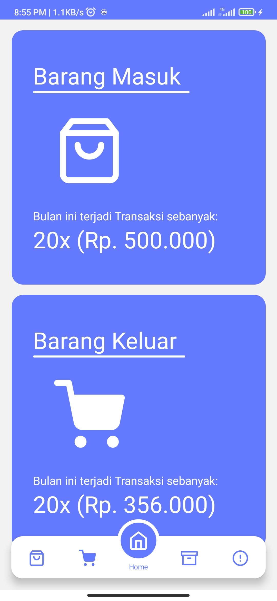
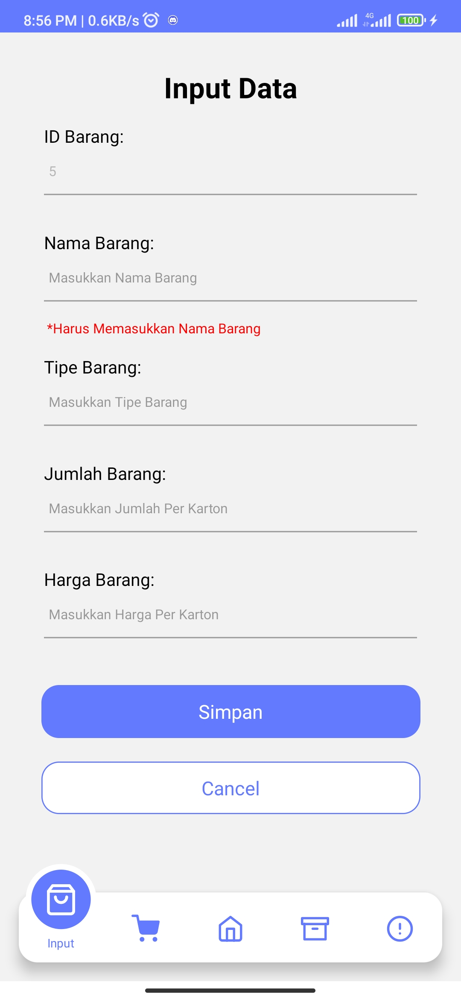
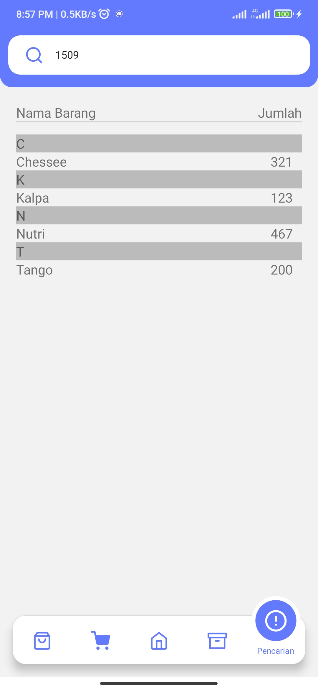
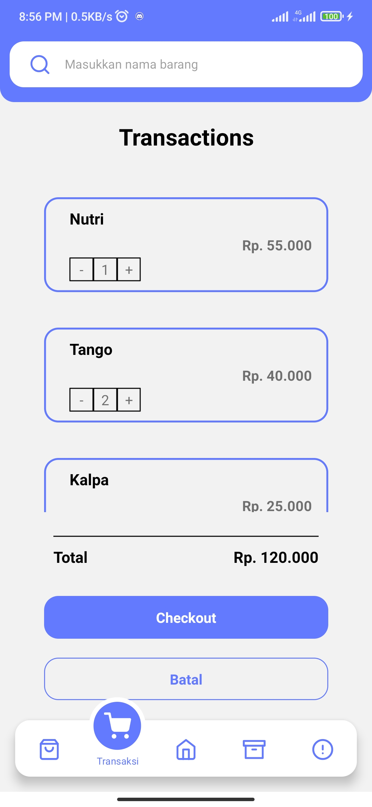

<div id="top"></div>

<!-- PROJECT LOGO -->
<br />
<div align="center">
  <a href="https://github.com/roufurrohim/R-warehouse">
    
  </a>

  <h3 align="center">R-Warehouse</h3>

  <p align="center">
    Android application for monitoring your's Store Warehouse
    <br />
    <a href="https://github.com/roufurrohim/R-warehouse"><strong>Explore the docs »</strong></a>
    <br />
    <br />
    <a href="https://github.com/roufurrohim/R-warehouse">View Demo</a>
    ·
    <a href="https://github.com/roufurrohim/R-warehouse/issues">Report Bug</a>
    ·
    <a href="https://github.com/roufurrohim/R-warehouse/issues">Request Feature</a>
  </p>
</div>


<!-- TABLE OF CONTENTS -->
<details>
  <summary>Table of Contents</summary>
  <ol>
    <li>
      <a href="#about-the-project">About The Project</a>
      <ul>
        <li><a href="#built-with">Built With</a></li>
      </ul>
    </li>
    <li>
      <a href="#getting-started">Getting Started</a>
      <ul>
        <li><a href="#installation">Installation</a></li>
      </ul>
    </li>
    <li><a href="#usage">Usage</a></li>
    <li><a href="#roadmap">Roadmap</a></li>
  </ol>
</details>


<!-- ABOUT THE PROJECT -->
## About The Project

This is a good Android application project for entrepreneurs who have a hawker shop warehouse and can be run offline and can also be used to transact for purchases from consumers. We used react-native to build this app in less than 36 hours, and the results are very satisfying. Thank you for taking the time to visit our repository.

<p align="right">(<a href="#top">back to top</a>)</p>


### Built With

* [React.js](https://reactjs.org/)
* [React Native](https://reactnative.dev/)
* [React-Native-Animatable](https://github.com/oblador/react-native-animatable)
* [React-Native-Gesture-Handler](react-native-gesture-handler)
* [React-Native-Reanimated](https://github.com/software-mansion/react-native-reanimated)
* [React-Native-Section-Alphabet-List](https://www.npmjs.com/package/react-native-section-alphabet-list)
* [React-Native-Screens](https://github.com/software-mansion/react-native-screens)

<p align="right">(<a href="#top">back to top</a>)</p>


<!-- GETTING STARTED -->
## Getting Started

### Installation

_Below is an example of how you can instruct your audience on installing and setting up your app. This template doesn't rely on any external dependencies or services._

1. Get a free API Key at [https://example.com](https://example.com)
2. Clone the repo
   ```sh
   git clone https://github.com/your_username_/Project-Name.git
   ```
3. Install NPM packages
   ```sh
   npm install
   ```
4. Enter your API in `config.js`
   ```js
   const API_KEY = 'ENTER YOUR API';
   ```

<p align="right">(<a href="#top">back to top</a>)</p>


<!-- USAGE EXAMPLES -->
## Usage

Use this space to show useful examples of how a project can be used. Additional screenshots, code examples and demos work well in this space. You may also link to more resources.

_For more examples, please refer to the [Documentation](https://github.com/roufurrohim/R-warehouse)_

<p align="right">(<a href="#top">back to top</a>)</p>


<!-- ROADMAP -->
## Roadmap

- [ ] Add Data on Input Screen
- [ ] View items on the Catatan Screen
- [ ] Checkout items on the Transaksi Screen
- [ ] Search for items in Pencarian Screen

<p align="right">(<a href="#top">back to top</a>)</p>


Below is a sample screenshot of the App Coffee Shop website and mobile display for users.

---------------------------------------------------
Display Home|Display Input Data
:-----------------------:|:----------------------------:
|
---------------------------------------------------
Display Catatan|Display Transaksi
:-----------------------:|:----------------------------:
|

<p align="right">(<a href="#top">back to top</a>)</p>